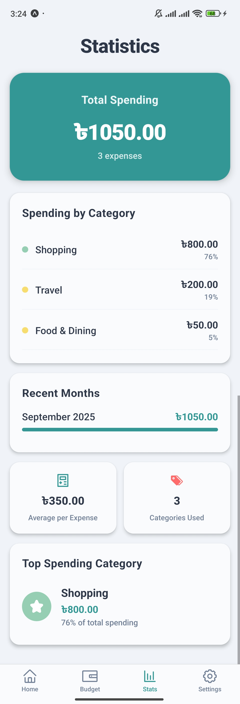
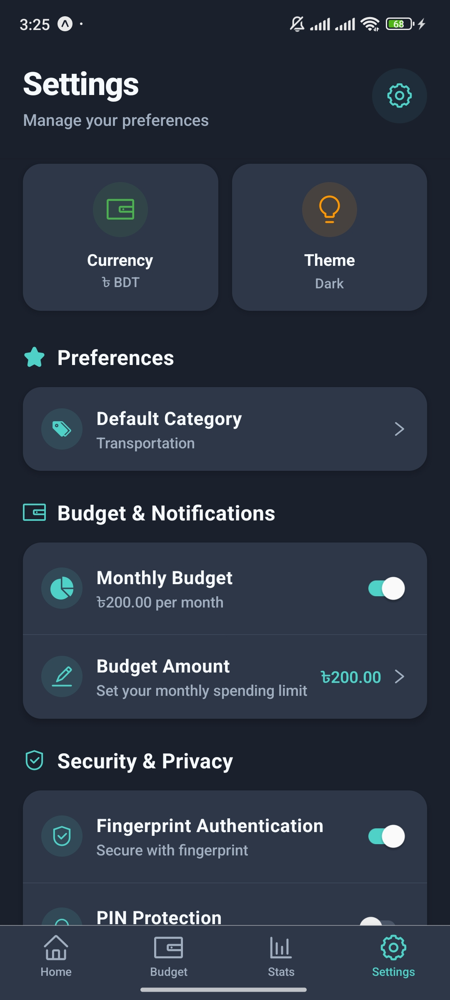

# Expensio 💰

A modern, feature-rich mobile expense tracking application built with React Native and Expo. Keep track of your spending, monitor budgets, and gain insights into your financial habits with an intuitive and secure interface.

## 📸 Screenshots

<div align="center">
  
  
  
  
</div>

<div align="center">
  
  
  
  
</div>

## 📱 Features

### 🏠 **Expense Management**

- **Add Expenses**: Quickly add new expenses with title, amount, category, date, and optional descriptions
- **View Expenses**: Browse all expenses in a clean, organized list with search functionality
- **Edit Expenses**: Modify existing expense details with a user-friendly interface
- **Delete Expenses**: Remove unwanted expenses with confirmation dialogs
- **Expense Details**: View comprehensive details of individual expenses
- **Search & Filter**: Find specific expenses using the built-in search functionality

<div align="center">
  
  
  
  
</div>


### 📊 **Statistics & Analytics**

- **Spending Analytics**: View detailed breakdowns of your spending patterns
- **Category Analysis**: See how much you spend in each category with visual representations
- **Monthly Trends**: Track spending trends over time with monthly data visualization
- **Budget Progress**: Monitor your budget usage with progress indicators
- **Total Spending**: Get quick overviews of your total expenses

<div align="center">
  
  
</div>


### 🎨 **Customization & Themes**

- **Dark/Light Mode**: Switch between elegant dark and light themes
- **Currency Selection**: Choose from 8 supported currencies (USD, EUR, GBP, JPY, INR, BDT, CAD, AUD)
- **Default Categories**: Set preferred expense categories for quick entry
- **Personalized Experience**: Customize the app to match your preferences

<div align="center">
  
  
  
  
</div>


### 🛡️ **Security & Privacy**

- **PIN Protection**: Secure your financial data with a custom PIN
- **Biometric Authentication**: Use fingerprint or face recognition for quick, secure access
- **Local Data Storage**: All data stored securely on your device using SQLite
- **Secure Settings**: Sensitive information protected with Expo SecureStore

<div align="center">
  
  
</div>


### 💰 **Budget Management**

- **Monthly Budget Setting**: Set and track monthly spending budgets
- **Budget Progress Tracking**: Visual indicators show budget usage percentage
- **Budget Monitoring**: Keep track of spending against your set budget limits
- **Budget History**: Monitor budget performance over time

<div align="center">
  
  
</div>


### 📂 **Data Management**

- **Export Data**: Export all expense data in JSON format for backup
- **Import Data**: Restore expenses from exported backup files
- **Clear Data**: Option to reset all data when needed
- **Data Integrity**: Robust database management ensures data consistency

<div align="center">
  
  
</div>


## 🛠️ Tech Stack

### **Frontend Framework**

- **React Native (0.79.5)** - Cross-platform mobile development
- **Expo SDK (~53.0.20)** - Development platform and build tools
- **TypeScript** - Type-safe development

### **Navigation**

- **@react-navigation/native (^7.1.17)** - Navigation framework
- **@react-navigation/bottom-tabs (^7.4.6)** - Tab-based navigation
- **@react-navigation/stack (^7.4.7)** - Stack navigation for screens

### **Data Storage & Management**

- **expo-sqlite (^15.2.14)** - Local SQLite database for expense storage
- **@react-native-async-storage/async-storage (^2.2.0)** - Local storage for app settings
- **expo-secure-store (^14.2.3)** - Secure storage for sensitive data (PINs, authentication)

### **Security & Authentication**

- **expo-local-authentication (^16.0.5)** - Biometric and PIN authentication
- **expo-secure-store (^14.2.3)** - Encrypted local storage

### **User Interface**

- **@expo/vector-icons (^14.1.0)** - Icon library (AntDesign icons)
- **@react-native-community/datetimepicker (^8.4.4)** - Date/time selection
- **@react-native-picker/picker (^2.11.1)** - Dropdown selections
- **Custom Theme System** - Dynamic light/dark theme switching

### **Development Tools**

- **expo-constants (^17.1.7)** - Access to system constants
- **expo-font (~13.3.2)** - Custom font loading
- **expo-updates (~0.28.17)** - Over-the-air updates

## 🏗️ Architecture

### **State Management**

- **React Context API** - Global state management for expenses and settings
- **Custom Hooks** - Reusable logic for database operations and settings

### **Database Structure**

```sql
expenses (
  id INTEGER PRIMARY KEY AUTOINCREMENT,
  title TEXT NOT NULL,
  amount REAL NOT NULL,
  category TEXT NOT NULL,
  date TEXT NOT NULL,
  description TEXT,
  created_at DATETIME DEFAULT (datetime('now','localtime'))
)
```

### **Service Layer**

- **DatabaseService** - Handles all SQLite operations and data management
- **SettingsService** - Manages app preferences, security, and configuration

## 📁 Project Structure

```
expensio/
├── screens/           # All application screens
│   ├── AddExpenseScreen.tsx
│   ├── ExpensesScreen.tsx
│   ├── StatsScreen.tsx
│   ├── SettingsScreen.tsx
│   ├── CurrencySelectionScreen.tsx
│   ├── EditExpenseScreen.tsx
│   ├── ExpenseDetailsScreen.tsx
│   └── AuthenticationScreen.tsx
├── services/          # Business logic and data services
│   ├── DatabaseService.ts
│   └── SettingsService.ts
├── context/           # Global state management
│   └── AppContext.tsx
├── types/             # TypeScript type definitions
│   └── navigation.ts
├── utils/             # Utility functions and themes
│   ├── themes.ts
│   └── demoData.ts
└── assets/           # Images and static resources
```

## 🚀 Installation & Setup

1. **Clone the repository**

   ```bash
   git clone https://github.com/AASani29/expensio.git
   cd expensio
   ```

2. **Install dependencies**

   ```bash
   npm install
   ```

3. **Start the development server**

   ```bash
   npx expo start
   ```

4. **Run on device**
   - Install Expo Go app on your mobile device
   - Scan the QR code displayed in terminal
   - Or run `npx expo start --android` / `npx expo start --ios`

## 📱 Supported Platforms

- ✅ **Android** (Expo Go & Production builds)
- ✅ **iOS** (Expo Go & Production builds)
- ⚠️ **Web** (Limited functionality)

## 🔐 Security Features

- **Local-first approach** - All data stays on your device
- **Encrypted storage** - Sensitive data protected with SecureStore
- **Biometric authentication** - Fingerprint/Face ID support
- **PIN protection** - Custom PIN for app access
- **No cloud dependencies** - Complete privacy and offline functionality
